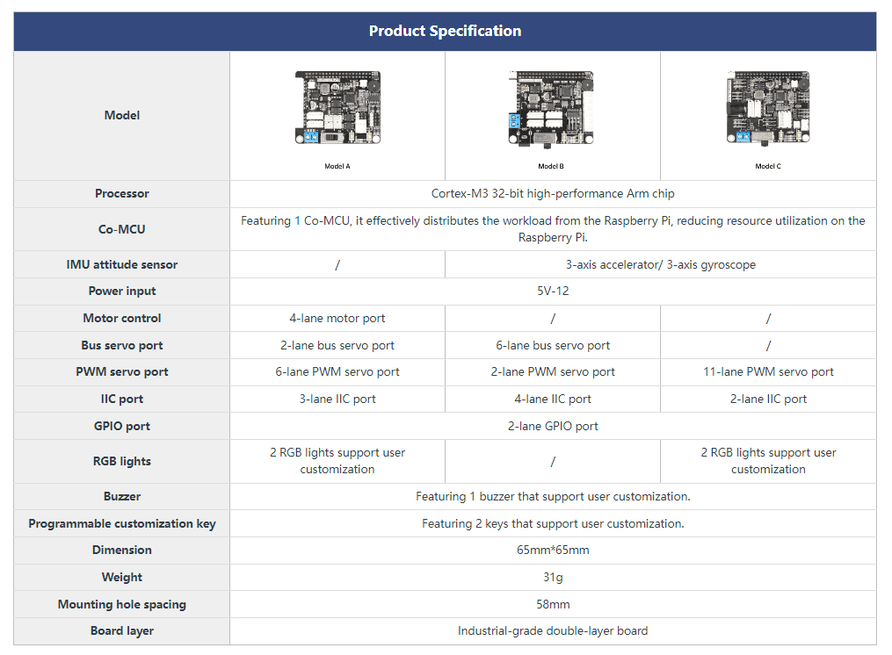
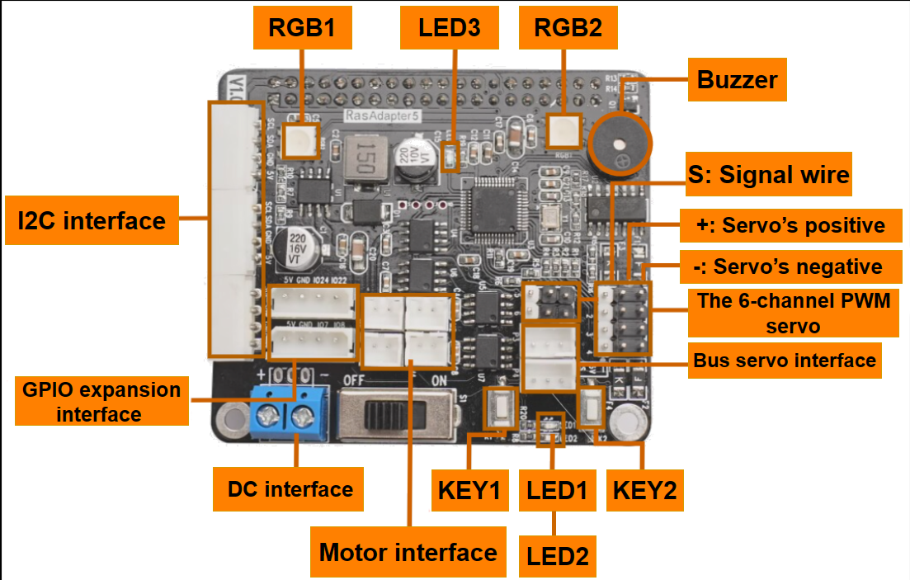
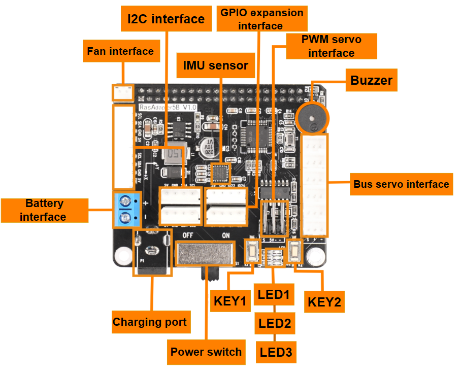
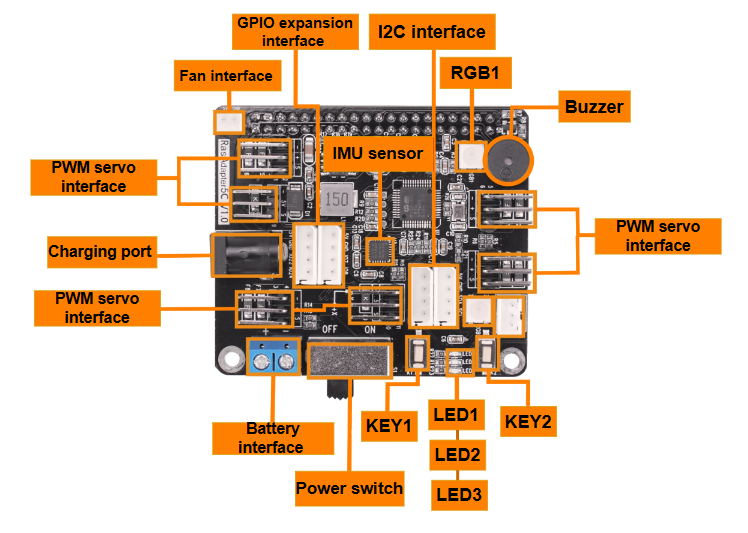

# 1. Introduction to Raspberry Pi Expansion Board Function Distribution

## 1.1 Introduction

The Raspberry Pi expansion board facilitates the Raspberry Pi connection to other sensors and execution components. With a wide variety of Raspberry Pi expansion boards available, Hiwonder has developed a multifunctional Raspberry Pi expansion board to meet the needs of various projects.

To adapt to different Raspberry Pi robots, three types of expansion boards A, B, and C are provided.

The differences between the three types are shown below:

The Raspberry Pi expansion board A comes with a 4-channel motor control chip SA8339, which is mainly used for Hiwonder Raspberry cars and robotic arms series, such as ArmPi FPV, ArmPi Pro, ArmPi mini, TurboPi, MasterPi, GoGoPi, and uHandPi.

Both the Raspberry Pi expansion boards B and C are equipped with a six-axis IMU. However, expansion board C does not have a bus servo interface. The expansion board B is mainly used for Raspberry Pi biorobots, such as TonyPi, TonyPi Pro, SpiderPi, and SpiderPi Pro.

The expansion board C is mainly applied to PuppyPi and PuppyPi Pro.

For further information about these products, please access the Hiwonder official website. About the components on these three expansion boards, please refer to the following instructions.

## 1.2 Raspberry Pi Expansion Board A

The Raspberry Pi expansion board A features a 4-channel motor interface, a 2-channel bus servo interface, a 6-channel PWM servo interface, a 3-channel I2C interface, a 2-channel GPIO interface, two RGB lights, a buzzer, two custom buttons, and three signal indicators (excluding the IUM sensor).

The functions of the interfaces on the Raspberry Pi expansion board A are shown below:

<table class="docutils-nobg" border="1">
    <thead>
        <tr>
            <th>Electronic Module</th>
            <th>Instruction</th>
        </tr>
    </thead>
    <tbody>
        <tr>
            <td>RGB light (RGB1, RGB2)</td>
            <td>To set the lighting, flashing, color, and other states of the RGB light through programming.</td>
        </tr>
        <tr>
            <td>Motor Interface</td>
            <td>Be externally connected to the motor, driving the motor to rotate.</td>
        </tr>
        <tr>
            <td>Buzzer</td>
            <td>Be set to make sounds through programming.</td>
        </tr>
        <tr>
            <td>PWM Servo Interface</td>
            <td>Connect and control the PWM servo.</td>
        </tr>
        <tr>
            <td>Bus Servo Interface</td>
            <td>Connect with the bus servo interface to rotate it and read the servo status.</td>
        </tr>
        <tr>
            <td>Function Key (KEY1)</td>
            <td>Short press to activate the robot self-check function.</td>
        </tr>
        <tr>
            <td>Function Key (KEY2)</td>
            <td>Long press to shut down the board.</td>
        </tr>
        <tr>
            <td>Power Indicator (LED1)</td>
            <td>Show the board's power status.</td>
        </tr>
        <tr>
            <td>WIFI Indicator (LED2)</td>
            <td>Show the WIFI connection status. In AP direct connection mode, it blinks every 2 seconds. In LAN mode, it remains on.</td>
        </tr>
        <tr>
            <td>Communication Indicator (LED3)</td>
            <td>Remain on and blink when receiving signals.</td>
        </tr>
        <tr>
            <td>DC Power Interface</td>
            <td>Be connected to a DC power supply to power the Raspberry Pi.</td>
        </tr>
        <!-- 合并GPIO Expansion Interface与I2C Interface的Instruction列 -->
        <tr>
            <td>GPIO Expansion Interface</td>
            <td rowspan="2">Used for user extension and expansion.</td>
        </tr>
        <tr>
            <td>I2C Interface</td>
        </tr>
    </tbody>
</table>

## 1.3 Raspberry Pi Expansion Board B

The Raspberry Pi expansion board B provides a 6-channel bus servo interface, a 2-channel PWM servo interface, a 1-channel fan interface, a 2-channel I2C interface, a 2-channel GPIO interface, a buzzer, two custom buttons, and a six-axis IUM sensor.

The functions of the interfaces on the Raspberry Pi expansion board B are shown below:

<table class="docutils-nobg" border="1">
  <thead>
    <tr>
      <th>Electronic Module</th>
      <th>Instruction</th>
    </tr>
  </thead>
  <tbody>
    <tr>
      <td>Buzzer</td>
      <td>Be set to make sounds through programming.</td>
    </tr>
    <tr>
      <td>PWM Servo Interface</td>
      <td>Connect and control the PWM servo.</td>
    </tr>
    <tr>
      <td>Bus Servo Interface</td>
      <td>Connect with the bus servo interface to rotate it and read the servo status.</td>
    </tr>
    <tr>
      <td>Function Key (KEY1)</td>
      <td>Short press to activate the robot self-check function.</td>
    </tr>
    <tr>
      <td>Function Key(KEY2)</td>
      <td>Long press to shut down the board.</td>
    </tr>
    <tr>
      <td>Power Indicator (LED1)</td>
      <td>Show the board's power status.</td>
    </tr>
    <tr>
      <td>WIFI Indicator (LED2)</td>
      <td>Show the WIFI connection status. In AP direct connection mode, it blinks every 2 seconds. In LAN mode, it remains on.</td>
    </tr>
    <tr>
      <td>Communication Indicator (LED3)</td>
      <td>Remain on and blink when receiving signals.</td>
    </tr>
    <tr>
      <td>Battery Interface</td>
      <td>Be connected to a DC power supply to power the Raspberry Pi.</td>
    </tr>
    <tr>
      <td>Charging Port</td>
      <td>Be connected to a charger to charge the battery.</td>
    </tr>
    <tr>
      <td>GPIO Expansion Interface</td>
      <td rowspan="2">Used for user extension and expansion.</td>
    </tr>
    <tr>
      <td>I2C Interface</td>
    </tr>
    <tr>
      <td>Fan Interface</td>
      <td>Be externally connected to a cooling fan.</td>
    </tr>
    <tr>
      <td>6-axis IMU Sensor</td>
      <td>Obtain the acceleration and gyroscope data of the X, Y, and Z axes of the robot.</td>
    </tr>
  </tbody>
</table>

## 1.4 Raspberry Pi Expansion Board C

The Raspberry Pi expansion board C is equipped with an 11-channel PWM servo interface, a 1-channel fan interface, a 2-channel I2C interface, a 2-channel GPIO interface, a 1-channel voltage indicator interface, a buzzer, two custom buttons, three signal indicators, and a six-axis IUM sensor.

The functions of the interfaces on the Raspberry Pi expansion board C are shown below:

<table class="docutils-nobg" border="1">
  <thead>
    <tr>
      <th>Electronic Module</th>
      <th>Instruction</th>
    </tr>
  </thead>
  <tbody>
    <tr>
      <td>RGB light (RGB1, RGB2)</td>
      <td>To set the lighting, flashing, color, and other states of the RGB light through programming.</td>
    </tr>
    <tr>
      <td>Buzzer</td>
      <td>Be set to make sounds through programming.</td>
    </tr>
    <tr>
      <td>PWM Servo Interface</td>
      <td>Connect and control the PWM servo.</td>
    </tr>
    <tr>
      <td>Bus Servo Interface</td>
      <td>Connect with the bus servo interface to rotate it and read the servo status.</td>
    </tr>
    <tr>
      <td>Function Key (KEY1)</td>
      <td>Short press to activate the robot self-check function.</td>
    </tr>
    <tr>
      <td>Function Key (KEY2)</td>
      <td>Long press to shut down the board.</td>
    </tr>
    <tr>
      <td>Power Indicator (LED1)</td>
      <td>Show the board's power status.</td>
    </tr>
    <tr>
      <td>WIFI Indicator (LED2)</td>
      <td>Show the WIFI connection status. In AP direct connection mode, it blinks every 2 seconds. In LAN mode, it remains on.</td>
    </tr>
    <tr>
      <td>Communication Indicator (LED3)</td>
      <td>Remain on and blink when receiving signals.</td>
    </tr>
    <tr>
      <td>Battery Interface</td>
      <td>Be connected to a DC power supply to power the Raspberry Pi.</td>
    </tr>
    <tr>
      <td>Charging Port</td>
      <td>Be connected to a charger to charge the battery.</td>
    </tr>
    <tr>
      <td>GPIO Expansion Interface</td>
      <td rowspan="2">Used for user extension and expansion.</td>
    </tr>
    <tr>
      <td>I2C Interface</td>
    </tr>
    <tr>
      <td>Fan Interface</td>
      <td>Be externally connected to a cooling fan.</td>
    </tr>
    <tr>
      <td>Voltage Indicator Interface</td>
      <td>Be externally connected to the voltage indicator.</td>
    </tr>
    <tr>
      <td>6-axis IMU Sensor</td>
      <td>Obtain the acceleration and gyroscope data of the X, Y, and Z axes of the robot.</td>
    </tr>
  </tbody>
</table>