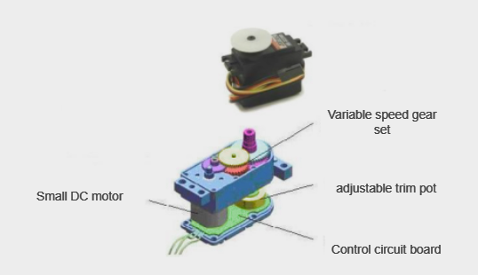
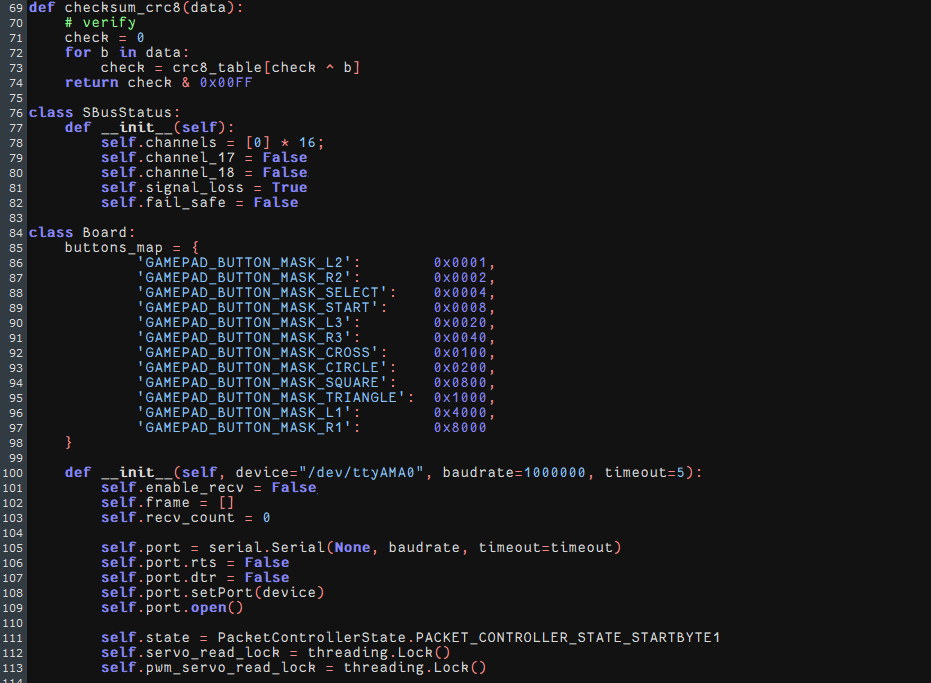

# 2. Expansion Board Control Lesson

## 2.1 Raspberry Pi Control Board Tutorial (Must-Read!)

If you installed the image control expansion board using the official online tool, follow the steps below to configure the environment for proper operation.

(1) Set up the environment and hardware control according to the appendix "**Extend Course: [Raspberry Pi 5 Controller](https://wiki.hiwonder.com/projects/Raspberry-Pi-5-Controller/en/latest/)**."


(2) Establish a remote connection using "**MobaXterm**" after successful configuration. (Refer to [**Raspberry Pi 5 Controller -\> 2. Raspberry Pi 5 Basic Operation and Configuration -\> 2.2 Remote Access and Remote File Transfer**](https://wiki.hiwonder.com/projects/Raspberry-Pi-5-Controller/en/latest/docs/2_Raspberry_Pi_5_Basic_Operation_and_Configuration.html#remote-access-and-remote-file-transfer))


(3) Modify the serial port settings: After connecting remotely, enter the command:

```bash
sudo nano /boot/firmware/config.txt
```


(4) Scroll to the end of the file and input the following to adjust the serial port:

```py
usb_max_current_enable=1  
avoid_warnings=1  
enable_uart=1  
dtparam=uart0=on
```


(5) Press Ctrl+S to save, then Ctrl+X to exit. Enter the command "**sudo reboot**" to reboot the Raspberry Pi .

```bash
sudo reboot
```

(6) Verify the serial port: After reboot, enter the command : **ls /dev - al**

```bash
ls /dev - al
```

(7) Scroll down to locate the content shown below, which confirms a successful modification:


(8) Transfer the demo file: Refer to "**[2.15 "board_demo" Analysis](#anchor_2_15)**" to copy the board_demo from the appendix to /home/pi/ on the Raspberry Pi.


(9) Run the example program (e.g., controlling the RGB light on the expansion board):

enter the command "**cd /home/pi/board_demo/**"

```bash
cd /home/pi/board_demo/
```

(10) After entering the board_demo folder, enter the command "**python3 rgb_control_demo.py**".


Press Ctrl+C to terminate the program.

## 2.2 RGB Color Control

This section demonstrates controlling the RGB light color on the expansion board. For example, sets the color of it to be red and green.

### 2.2.1 Working Principle

RGB represents red, green, blue three color channels. Their parameter ranges are all from 0 to 255, with higher value indicating darker color. In the program, the flashing frequency of the RGB lights is controlled by modifying the delay time for turning them on and off. The source code of the program is located in : **[/home/pi/board_demo/rgb_control_demo.py](https://drive.google.com/drive/folders/1l0dHNl8qMQo-WB1Af9wp23Msr-wEy8yj?usp=sharing)**


(1) This section demonstrates controlling RGB through calling the `set_rgb()` function in the Board library. Take `board.set_rgb([[1, 255, 0, 0], [2, 255, 0, 0]])` as an example:

(2) Among that, the first parameter `1` means RGB2. Parameter `2` represents RGB2.

(3) The second parameter `255,0,0` represents color channel parameter. Among that, the first parameter `255` represents the value of "R" channel (red); the second and the third parameters represent the value of `G`, `B` channel respectively.

### 2.2.2 Getting Ready 

The Raspberry Pi expansion board has two RGB lights as pictured:


### 2.2.3 Operation Steps

(1) Turn the device on and connect the robot through the VNC remote connection tool.


(2) Click the icon  in the left corner of the desktop, or press the shortcut key "**Ctrl+Alt+T**" to open the command line terminal.


(3) Enter the command "**cd board_demo/**" in the directory where the program is located.

```bash
cd board_demo/
```

(4) Next, enter the command "**python3 rgb_control_demo.py**" to run the program.

```bash
python3 rgb_control_demo.py
```


(5) You can press "**Ctrl+c**" to close this program. If you fail to close the program, repeat the process until you exit.

### 2.2.4 Program Outcome

Once the program is running, the two RGB lights on the Raspberry expansion board emit red, green, blue and yellow in a loop.

## 2.3 RGB Light Flashing Control

The section will demonstrate how to achieve color changes flashing every 0.5 seconds by controlling the RGB lights on the expansion board.

### 2.3.1 Working Principle

RGB represents red, green, blue three color channels. Their parameter ranges are all from 0 to 255, with higher value indicating darker color. In the program, the flashing frequency of the RGB lights is controlled by modifying the delay time for turning them on and off. The source code of the program is located in : **/home/pi/board_demo/rgb_control_demo.py**


This section demonstrates controlling RGB through calling the `set_rgb()` function in the Board library. Take `board.set_rgb([[1, 255, 0, 0], [2, 255, 0, 0]])` as an example:

The first parameter `1` means RGB2. Parameter `2` represents RGB2.

The second parameter `255,0,0` represents color channel parameter. The first parameter `255` represents the value of "R" channel (red); the second and the third parameters represent the value of `G`, `B` channel respectively.

Use a delay of `time.sleep(0.5)` to achieve the RGB lights flashing.

### 2.3.2 Getting Ready

The Raspberry Pi expansion board has two RGB lights as pictured:


### 2.3.3 Operation Steps

(1) Turn the device on and connect the robot through the VNC remote connection tool.


(2) Click the icon  in the left corner of the desktop, or press the shortcut key "**Ctrl+Alt+T**" to open the command line terminal.


(3) Enter the command "**cd board_demo/**" in the directory where the program is located.

```bash
cd board_demo/
```

(4) Next, enter the command "**python3 rgb_control_demo.py**" to run the program.

```
python3 rgb_control_demo.py
```

(5) You can press "**Ctrl+c**" to close this program. If you fail to close the program, repeat the process until you exit.

### 2.3.4 Program Outcome

Once the program is running, the two RGB lights on the Raspberry expansion board emit red, green, blue and yellow.

## 2.4 Button Control

This section demonstrates controlling the color of RGB lights through different keys on the expansion board.

### 2.4.1 Working Principle

According to the pressed keys, detect the color state of the RGB lights controlled by GPIO port's high and low voltage levels.


(1) Initialize the Raspberry Pi expansion board and GPIO pins, handle the "**Ctrl+C**" signal, and set a signal handling function to exit the program. In a loop, constantly check the status of two buttons.

(2) If key1 is pressed, set the color of RGB lights to red.

(3) If key2 is pressed, set the color of RGB light to blue.

(4) Print the key state. (press or release)

(5) Perform in a loop until receive the Ctrl+C signal to end the program.

(6) The source code of this program is located in: /home/pi/board_demo/key.py

### 2.4.2 Getting Ready

The Raspberry Pi expansion board has two keys as pictured:


### 2.4.3 Operation Steps

(1) Turn the device on and connect the robot through the VNC remote connection tool.


(2) Click the icon  in the left corner of the desktop, or press the shortcut key "**Ctrl+Alt+T**" to open the command line terminal.


(3) Enter the command "**cd board_demo/**" in the directory where the program is located.

```bash
cd board_demo/
```

(4) Next, enter the command "**python3 rgb_control_demo.py**" to run the program.

```
python3 rgb_control_demo.py
```


(5) Input command  **sudo systemctl stop hw_button_scan.service**.

```bash
sudo systemctl stop hw_button_scan.service
```

(6) Input command "**python3 key.py**". Then press enter key. And it will print a prompt.

```
python3 key.py
```

Press key1 to set the light to red. Press key2 to set the light to blue. Press CTRL+C to close the program.

(7) After completing the program, it is necessary to restart the `hw_button_scan` service. Input the command to restart the service command  "**sudo systemctl start hw_button_scan.service**".

```
sudo systemctl start hw_button_scan.service
```

### 2.4.4 Project Outcome

If key1 is pressed, use the `board.set_rgb()` function to set the RGB color to red.

If key2 is pressed, use the `board.set_rgb()` function to set the RGB color to blue.

Print the statues of the keys (key1_state and key2_state) on the console. Then press CTRL+C to exit the procedure.

## 2.5 Buzzer Control

This section demonstrates how to control the buzzer on the expansion board to make sounds.

### 2.5.1 Working Principle

Set the `set_buzzer()` function to adjust the buzzer's high and low voltage levels.

The source code of the program is located in "**/home/pi/board_demo/ buzzer_control_demo.py/**".


The program calls the `set_buzzer()` function in the `Board` library to adjust the buzzer's high and low voltage levels. The parameters in the `set_buzzer(1900, 0.1, 0.9, 1)` function are set to a frequency of 1900Hz, with the buzzer sounding for 0.1s, followed by a 0.9s pause, and repeating once.

### 2.5.2 Getting Ready

A buzzer is mounted on the Raspberry Pi expansion board, as shown below:


### 2.5.3 Operation Steps

(1) Turn the device on and connect the robot through the VNC remote connection tool.


(1) Click  in the top left corner of the desktop, or press the shortcut key "**Ctrl+Alt+T**" to open the command line terminal.


(2) Enter the command "**cd board_demo/**" in the directory where the program is, and press "**Enter**".

```bash
cd board_demo/
```

(3) Enter the command "**python3 buzzer_control_demo.py**", and press "**Enter**" to activate the game. The buzzer will make a short sound and then three long sounds to automatically exit the program.

```
python3 buzzer_control_demo.py
```

### 2.5.4 Program Outcome

After the program is activated, the buzzer on the Raspberry Pi expansion board makes a short sound and three long sounds to exit the program.

<p id="anchor_2_6"></p>

## 2.6 Single PWM Servo Control

This section focuses on controlling the rotation of a single servo by utilizing the No.1 PWM interface on the expansion board.

### 2.6.1 Working Principle

In the program, modify the runtime and servo pulse width to control the rotation of the servo. The source code of the program is located in "**/home/pi/board_demo/single_servos.py**".


The program calls the `pwm_servo_set_position()` function in the "**Board**" library to implement the servo control. Take `board.pwm_servo_set_position(0.5, [[1, 1500]])` as an example, among them:

The first parameter `0.5` indicates the servo's runtime is 500ms. If it is `1`, indicating the runtime is 1000ms.

The second parameter `[[1, 1500]]` represents setting the No.1 servo's pulse width as 1500.

### 2.6.2 Getting Ready

There are 6 PWM servo interfaces on the Raspberry Pi expansion board. Let's test by connecting the No.1 servo, as shown below: 


### 2.6.3 Operation Steps

(1) Turn the device on and connect the robot through the VNC remote connection tool.


(2) Click  in the top left corner of the desktop, or press the shortcut key "**Ctrl+Alt+T**" to open the command line terminal.


(3) Enter the command "**cd board_demo/**" to navigate to the directory where the demo program is located, then press "**Enter**".

```bash
cd board_demo/
```

(4) Enter the command of running the program "**python3 single_servos.py**", and press "**Enter**".

```
python3 single_servos.py
```

(5) To close the program, press "**Ctrl+c**". If the program cannot be closed successfully, repeat this operation until it exits.

### 2.6.4 Program Outcome

Once the program is executed, the Raspberry Pi expansion board can adjust the pulse width of the servo to control its angular position, thereby achieving different motion effects.

### 2.6.5 PWM Servo Introduction

*  **Servo Working Principle**

(1) What is a Servo

A servo, also known as a servo motor, was initially used to control the steering of ships. Due to its ability to precisely control the rotation angle of the rubber, it is commonly used in mechanical systems with high precision requirements. Servos play a crucial role in robots, including both industrial and home service robots, all of which necessitate precise control capabilities. Servos act as the joints in robots, functioning as part of the actuator system. Therefore, servos can be metaphorically described as the muscles of robots, providing them with the necessary power.

(2) How does a Servo Work

The servo consists of four parts: a motor, a control circuit board, a gear set, and a potentiometer.



A traditional servo has three wires: a power wire, a GND wire, and a signal control wire.

Its working principle is as follows: when the control circuit board of the servo receives a pulsing signal, it controls the rotation of the motor. The motor drives the output shaft to rotate via a gear set, and the rotation of the output shaft also drives the potentiometer to rotate. The control circuit board detects the rotation of the potentiometer and determines if it has rotated to the specified angle. If it has, the motor stops rotating; otherwise, the motor continues to rotate.


(3)  PWM Servo Introduction

A PWM servo is controlled by PWM, which differentiates it from the traditional analog servo that requires continuous PWM signals to maintain a specific position or rotate at a certain speed. However, a PWM servo only needs to receive one PWM signal to remain in a specific position.

Before assembling a servo, it is necessary to adjust the servo to the neutral position.

The neutral position of a servo is its initial position, and it is used as the "**zero point**" for positive and negative angle rotations. It's necessary to adjust the servo to the neutral position before installing it onto the servo horn.

This is because when a servo rotates, its rotating components drive the potentiometer to rotate, and the software assumes that the neutral position is the "**zero point**". Otherwise, the potentiometer may enter a "**dead zone**", causing the entire components to malfunction. In robot applications, this can result in the servo failing to reach the specified angle or producing inconsistent action groups.

## 2.7 PWM Servo Speed Control

This lesson focuses on controlling the No.1 PWM interface on the 

expansion board to control the speed of the servo by adjusting its angle.

This adjustment relies on altering the time it takes for the servo to reach the desired angle position. For detailed principle instruction of PWM 

servo, please refer to "[**2.6 Single PWM Servo Control**](#anchor_2_6)".

### 2.7.1 Working Principle

In the program, modify the runtime, servo ID, and servo pulse width to control the rotation speed of the servo. The source code of the program is located in "**/home/pi/board_demo/pwm_servo_speed.py**".


The program calls the `pwm_servo_set_position()` function in the `Board` library to implement the servo control. Take `board.pwm_servo_set_ position(0.5, [[1, 1500]])` as an example, among them:

The first parameter `0.5` indicates the servo's runtime is 500ms. If it is `1`, indicating the runtime is 1000ms.

The second parameter `[[1, 1500]]` represents setting the No.1 servo's pulse width as 1500.

### 2.7.2 Getting Ready

There are 6 PWM servo interfaces on the Raspberry Pi expansion board. Let's test by connecting the No.1 servo, as shown below:


### 2.7.3 Operation Steps

(1) Turn the device on and connect the robot through the VNC remote connection tool.


(2) Click  in the top left corner of the desktop, or press the shortcut key "**Ctrl+Alt+T**" to open the command line terminal.


(3) Enter the command "**cd board_demo/**" to navigate to the directory where the demo program is located, then press "**Enter**".

```bash
cd board_demo/
```

Enter the command of running the program "**python3 pwm_servo_speed.py**", and press "**Enter**".

```
python3 pwm_servo_speed.py
```

(4) To close the program, press "**Ctrl+C**". If the program cannot be closed successfully, repeat this operation until it exits.

### 2.7.4 Program Outcome

Once the program is executed, the Raspberry Pi expansion board

can adjust the pulse width of the servo to control the time it takes to reach a specific angle, This enables speed control of the servo motor.

## 2.8 Multiple PWM Servos Control

This lesson focuses on controlling the No.1 and No.2 PWM 

interfaces on the expansion board to achieve the motion control of 

multiple servos. For detailed principle instruction of PWM servo, please 

refer to "[**2.6 Single PWM Servo Control**](#anchor_2_6)".

### 2.8.1 Working Principle

Let's view the implementation idea of this lesson:

Control the servo rotation by transmitting pulse signals and setting the rotation angle and duration of the servo through code parameters. The source code of the program is located in "**/home/pi/board_demo/pwm_servo_control\_ demo.py**".


The program calls the `pwm_servo_set_position()` function in the "**Board**" library to implement the servo control. Take `board.pwm_servo_set_position(1, [[1, 1100]])` as an example, among them:

The first parameter `1` indicates the servo's runtime is 1s.

The second parameter `[[1, 1100]]` represents setting the No.1 servo's pulse width as 1100.

### 2.8.2 Getting Ready

There are 6 PWM servo interfaces on the Raspberry Pi expansion board. Let's test by connecting the No.1 and No.2 servo interfaces, as shown below: 


### 2.8.3 Operation Steps

(1) Turn the device on and connect the robot through the VNC remote connection tool.


(2) Click  in the top left corner of the desktop, or press the shortcut key "**Ctrl+Alt+T**" to open the command line terminal.


(3) Enter the command "**cd board_demo/**". Then press "**Enter**" to navigate to the directory where the demo program is located.

```bash
cd board_demo/
```

(4) Enter the command "**python3 pwm_servo_speed.py**". Press "**Enter**" to execute the program.

```
python3 pwm_servo_speed.py
```

(5) To close the program, press "**Ctrl+c**". If the program cannot be closed successfully, repeat this operation until it exits.

### 2.8.4 Program Outcome

Once the program is executed, the servos 1 and 2 rotate circularly.

<p id="anchor_2_8_5"></p>

### 2.8.5 Function Extension

* **Replace Servo Interface**

The program sets to rotate the servo connected to No.1 servo interface first by default. If it's necessary to replace the servo interface, insert the servo into the specified interface first, then perform the operation. Here is an example of changing to No.2 servo interface:

(1) Enter the command "**cd /home/pi/board_demo/**". Then press "**Enter**" to navigate to the directory where the demo program is located.

```bash
cd /home/pi/board_demo/
```


(2) Enter the command "**vim pwm_servo_control_demo.py**". Press "**Enter**" to open the program file.

```bash
vim pwm_servo_control_demo.py
```

(3) Enter "**:set number**" in the opened page to display the line numbers. Please set it based on your own needs.

```bash
:set number
```


(4) Locate the codes shown below in the opened page:


(5) Press "**i**" on the keyboard to enter the editing mode.


(6) Modify the first parameters "1" into "2" in parentheses of the `board.pwm_servo_set_position`, as shown below:


(7) After the modification is completed, press "**Esc**" on the keyboard. Then enter "**:wq**" (do not miss the colon before wq), and press "**Enter**" to save and exit the program.


(8) After it exits, enter the command "**python3 pwm_servo_control_demo. py**" to see the modified effect.

```
python3 pwm_servo_control_demo.py
```


* **Modify Rotation Angle**

The program sets the initial state of servo 1 to rotate in a loop between 54 and 90 degrees. If you want to customize the servo rotation angle, for example, change the servo to rotate in a loop from 30 to 120 degrees, please follow the steps below.

(1) Follow the steps in "[**2.8.5 Function Extension-> Replace Servo Interface**](#anchor_2_8_5)" to open the program file, and locate the codes shown below.


(2) The servo rotation range is between 500 and 2500 pulse widths, which is equivalent to 0 to 180 degrees. For example, 1500 pulse width is 90 degrees, which means that 1 degree is equal to 11.1 pulse widths. The formula for converting angles to position values is 11.1 \* angle + 500.


(3) After the modification is completed, press "**Esc**" on the keyboard. Then enter "**:wq**" (do not miss the colon before wq), and press "**Enter**" to save and exit the program.


(4) After it exits, enter the command "**python3 pwm_servo_control_demo.py**" to see the modified effect.

```
python3 pwm_servo_control_demo.py
```

<p id="anchor_2_9"></p>

## 2.9 Read Bus Servo Status

Read the servo ID, voltage, position, and temperature data of the bus servo on the expansion board in the program. The source code of the program is located in "**/home/pi/board_demo/bus_servos_read.py**".


Call the `board.bus_servo_read_id(), board.bus_servo_read_vin(), board.bus_servo_read_temp(), board.bus_servo_read_position()` functions in the `Board` library to read the data of the bus servo.

### 2.9.1 Getting Ready

There are 2 bus servo interfaces on the Raspberry Pi expansion board. Let's test by connecting the No.1 bus servo interface, as shown below:


### 2.9.2 Operation Steps

(1) Turn the device on and connect the robot through the VNC remote connection tool.


(2) Click  in the top left corner of the desktop, or press the shortcut key "**Ctrl+Alt+T**" to open the command line terminal.


(3) Enter the command "**cd board_demo/**" to navigate to the directory where the demo program is located, then press "**Enter**".

```bash
cd board_demo/
```

Enter the command of running the program "**python3 bus_servos_read.py**", and press "**Enter**".

```
python3 bus_servos_read.py
```

(4) To close the program, press "**Ctrl+c**". If the program cannot be closed successfully, repeat this operation until it exits.

### 2.9.3 Program Outcome

(1)  Once the program is executed, the Raspberry Pi expansion board can read the data of bus servo to print, details are as follows:

(2) `id`: 1 indicates that the servo ID is 1. Each servo has a unique ID that is used to identify different servos.

(3)`vin`: \[5511\] indicates that the input voltage of the servo is 5511. This is the voltage value that the servo receives from the power supply, in the unit of mV.

(4) `temp`: \[31\] indicates that the temperature of the servo is 31. This is the current temperature of the servo, in the unit of ℃.

(5) `position`: \[263\] indicates that the position of the servo is 263. This is the current position value of the servo.

(6) The ID, input voltage, temperature, and position information of the servo that has been read can be used to monitor the bus servo on the Raspberry Pi expansion board.

### 2.9.4 Bus Servo Introduction

* **Bus Servo Introduction**

Bus servos are the derivative of digital servos, but differ from traditional PWM digital servos. They communicate via asynchronous serial bus, allowing for control through the sending and receiving of instruction packets. This closed-loop control method allows bus servos to be connected in series, simplifying wiring and reducing the use of serial ports.

Therefore, when connecting bus servos, just like giving names to people, each servo must be assigned a unique ID beforehand, otherwise they cannot be distinguished during control. This allows commands such as "**Rotate servo ID1 by 30 degrees**" and "**Rotate servo ID2 by 40 degrees**" to be sent when communicating with bus servos.

Bus servos adopt high-precision potentiometers internally, and compared to PWM servos, they not only have the ability to provide feedback on information such as position, temperature, and voltage, but also have good precision and linearity, resulting in more stable robot operation and longer servo lifespan.

Additionally, before assembling the servo, it is necessary to perform a neutral operation to set the initial position, which is used as the "zero point" for positive and negative angle rotation. Therefore, the servo must be adjusted to the neutral position before installation onto the servo horn.

When the servo motor rotates, it moves the potentiometer to rotate. The software assumes this neutral position is the "**zero point**". Otherwise, the potentiometer might enter a "**blind spot**", causing the entire component to malfunction. This can result in the servo being unable to reach the specified angle or the action group corresponding to the angle being inconsistent during robot operation.

## 2.10 Bus Servo Rotation Control

This lesson focuses on controlling the rotation of the bus servo on the expansion board. Please note that the expansion board C does not include the bus servo interface. For detailed introduction of bus servo, please refer to "[**2.9 Read Bus Servo Status**](#anchor_2_9)".

### 2.10.1 Working Principle

In the program, modify the ID, runtime, and position of the servo to control the rotation of the bus servo. The source code of the program is located in "**/home/pi/board_demo/bus_servo_turn.py**".


The program calls the `board.bus_servo_set_position` function in the `Board` library to implement the servo control. Take `board.bus_servo_set _position(1, [[1, 500], [2, 500]])` as an example:

The first parameter `1` indicates the servo's runtime is 1000ms.

The second parameter `[[1, 500]]` represents setting the No.1 servo's rotation angle as 500.

The third parameter `[[2, 500]]` represents setting the No.1 servo's rotation angle as 500.

### 2.10.2 Getting Ready

There are 2 bus servo interfaces on the Raspberry Pi expansion board. Let's test by connecting the No.1 bus servo interfaces, as shown below: 


### 2.10.3 Operation Steps

(1) Turn the device on and connect the robot through the VNC remote connection tool.


(2) Click  in the top left corner of the desktop, or press the shortcut key "**Ctrl+Alt+T**" to open the command line terminal.


(3) Enter the command "**cd board_demo/**" to navigate to the directory where the demo program is located, then press "**Enter**".

```bash
cd board_demo/
```

Enter the command of running the program "**python3 bus_servos_turn.py**", and press "**Enter**".

```bash
python3 bus_servos_turn.py
```


(4) To close the program, press "**Ctrl+C**". If the program cannot be closed successfully, repeat this operation until it exits.

### 2.10.4 Program Outcome

Once the program is executed, the Raspberry Pi expansion board can adjust the position parameters of the servo to control its angle position. This enables achieving different motion effects.

## 2.11 Adjust Bus Servo Speed

This lesson aims to control the rotation speed of the bus servo on the expansion board. For detailed introduction of bus servo, please refer to "[**2.9 Read Bus Servo Status**](#anchor_2_9)".

### 2.11.1 Working Principle

In the program, modify the ID, runtime, and position of the servo to control the rotation of the bus servo. The source code of the program is located in "**/home/pi/board_demo/bus_servo_speed.py**".


The program calls the `board.bus_servo_set_position` function in the "**Board**" library to implement the servo control.

(1) The `board.bus_servo_set_position` function is used to set the angle position of the bus servo. It receives two parameters: `0.5` represents the time of the servo rotation; `[[1, 0], [2, 0]]` represents the servo and its corresponding angle position to be set.

(2)  `[[1, 0], [2, 0]]` is used to set the angle positions of servos 1 and 2 to `0` degree.

(3)  Use the `time.sleep` function to wait for 0.5s to ensure that the servo has enough time to rotate to the specified angle.

(4) Then, the `board.bus_servo_set_position` is called again to set the angle positions of servos 1 and 2 to 1000 degrees. The first parameter `2` indicates the rotation time is 2.

(5) Similarly, use the `board.bus_servo_stop` function to wait for 1s to rotate the servo to the specified angle.

(6) The `board.bus_servo_stop` function is called to stop the motion of servos 1 and 2. It takes a parameter, which is a list of servo numbers to be stopped. In this case, passing `[1, 2]` as the parameter means stopping the motion of servos 1 and 2.

### 2.11.2 Getting Ready

There are 2 bus servo interfaces on the Raspberry Pi expansion board. Let's test by connecting the No.1 bus servo interfaces, as shown below:


### 2.11.3 Operation Steps

(1) Turn the device on and connect the robot through the VNC remote connection tool.


(2) Click  in the top left corner of the desktop, or press the shortcut key "**Ctrl+Alt+T**" to open the command line terminal.


(3) Enter the command "**cd board_demo/**" to navigate to the directory where the demo program is located, then press "**Enter**".

```bash
cd board_demo/
```

Enter the command of running the program "**python3 bus_servo_speed.py**", and press "**Enter**".

```
python3 bus_servo_speed.py
```

(4) To close the program, press "**Ctrl+c**". If the program cannot be closed successfully, repeat this operation until it exits.

### 2.11.4 Program Outcome

Once the program is executed, the Raspberry Pi expansion board sets the servo to the initial position (0), then rotates it to the specified angle position (1000), and finally stops its motion. By adjusting the parameters, the Raspberry Pi expansion board can control the angle position and runtime of different servos. This allows the speed control of the servo.

## 2.12 Drive DC Motor

This lesson demonstrates on how to drive a DC motor on the expansion board to rotate at different speeds. Please note that the expansion boards B and C do not include motor interfaces.

### 2.12.1 Working Principle

This program enables you to set the parameters of the motor, with positive values making it move forward and negative values making it move backward. The source code of the program is located in "**/home/pi/board_demo/motor_ control_demo.py**".


The `set_motor_duty()` function in the `Board` library is called for the control of chassis motor. Take `board.set_motor_duty([[1, 35]])` as an example:

The parameter `[[1, 35]]` sets the duty cycle of the motor. It is a nested tuple including the motor number 1 and the duty cycle 35, indicating a speed of 35.

### 2.12.2 Getting Ready

There are 4 motor interfaces on the Raspberry Pi expansion board, as shown below. Let's test by connecting the No.1 motor interface (M1).


<p id="anchor_2_12_3"></p>

### 2.12.3 Operation Steps

(1) Turn the device on and connect the robot through the VNC remote connection tool.


(1) Click  in the top left corner of the desktop, or press the shortcut key "**Ctrl+Alt+T**" to open the command line terminal.


(2) Enter the command "**cd board_demo/**" to navigate to the directory where the demo program is located, then press "**Enter**".

```bash
cd board_demo/
```

(3) Enter the command of controlling the motor rotation "**python3 motor_control_demo.py**", and press "**Enter**".

```
python3 motor_control_demo.py
```

(4) To close the program, press "**Ctrl+c**". If the program cannot be closed successfully, repeat this operation until it exits.

### 2.12.4 Program Outcome

After the program is activated, the DC motor M1 will rotate clockwise at a speed of 35 for 0.2s, followed by counterclockwise rotation at a speed of 90 for 0.2s. This cycle will continue repeatedly.

<p id="anchor_2_12_5"></p>

### 2.12.5 Function Extension

* **Adjust Speed and Orientation**

> [!Note]
> The speed range of the motor is -100 to 100. Please ensure that the values are set in this range to avoid damaging the motor.

If you want to modify the speed and orientation of motor rotation,please follow the steps below.

This section demonstrates controlling the motor connected to the</span> interface 1. It will rotate clockwise at a speed of 80 for 2 seconds, then reverse at a speed of 60 for another 2 seconds.

(1) Enter the command "**cd /home/pi/board_demo/**" to navigate to the directory where the demo program is located, then press "**Enter**".

```bash
cd /home/pi/board_demo/
```

(2) Enter the command of opening the program "**vim motor_control_demo.py**", and press "**Enter**".

```bash
vim motor_control\_ demo.py
```

(3) Locate the codes shown below in the opened page.


(4) Press "**i**" on the keyboard to enter the editing mode.


(5) Modify the section highlighted in the boxed area below. Please note that when the speed value is positive, the motor rotates clockwise. The higher the value, the faster the clockwise rotation. When the speed value is negative, the motor rotates counterclockwise, and the lower the value, the faster the counterclockwise rotation.


(6) After the modification is completed, press "**Esc**" on the keyboard. Then enter "**:wq**" (do not miss the colon before wq), and press "**Enter**" to save and exit the program.


(7) After saving the program, follow the steps in "[**2.12.3 Operation Steps**](#anchor_2_12_3)" to view its execution effects.

* **Adjust Motor Interface**

(1) The program defaults to the motor interface 1. Let's use the modification of switching the motor interface to the motor 2 as an example. Please refer to "[**2.12.5 Function Extension ->Adjust Speed and Orientation**](#anchor_2_12_5)" to locate the code for the motor parameters, and enter the editing mode.

(2) Change the motor interface from M1 to M2, as shown below:


(3) After the modification is completed, press "**Esc**" on the keyboard. Then enter "**:wq**" (do not miss the colon before wq), and press "**Enter**" to save and exit the program.


(4) After saving the program, follow the steps in "[**2.12.3 Operation Steps**](#anchor_2_12_3)" to view its execution effects.

## 2.13 GPIO Port Control

This lesson aims to demonstrate on how to utilize the high and low voltage levels of GPIO port on the expansion board.

### 2.13.1 Working Principle

This program controls the high and low voltage levels of a GPIO port on the Raspberry Pi to rotate a fan module. The fan will rotate clockwise for 3s, followed by counterclockwise rotation for another 3s. The source code of the program is located in "**/home/pi/board_demo/gpio_control.py**".


(1) This section provides GPIO pin control through the gpiod module.

(2) Create an instance of the `Chip` class to initialize GPIO.

(3) The `get_line` method is used to obtain two GPIO pins 8 and 7 from the Raspberry Pi, which are respectively assigned to the variables `fanPin1` and `fanPin2`.

(4) The `request` method is used to set the direction of both pins to output.

(5) The `set_direction` function sets the values of `fanPin1` and `fanPin2` to control the rotation direction of the fan.

(6) The `rotate_clockwise` function calls `set_direction` to rotate the fan clockwise.

(7) The `rotate_counterclockwise` function calls `set_direction` to rotate the fan counterclockwise.

(8) The `stop_rotation` function calls `set_direction` to stop the rotation of the fan.

### 2.13.2 Getting Ready

There are 4 GPIO ports on the Raspberry Pi expansion board. Let's use GPIO7 and GPIO8 to control.


### 2.13.3 Operation Steps

(1) Turn the device on and connect the robot through the VNC remote connection tool.


(2) Click  in the top left corner of the desktop, or press the shortcut key "**Ctrl+Alt+T**" to open the command line terminal.


(3) Enter the command "**cd board_demo/**" to navigate to the directory where the demo program is located, then press "**Enter**".

```bash
cd board_demo/
```

Enter the command of running the program "**python3 gpio_control.py**", and press "**Enter**".

```
python3 gpio_control.py
```

(4) Press "**Ctrl+c**" to close the program. If the program cannot be closed successfully, repeat this operation until it exits.

### 2.13.4 Program Outcome

After the program is executed，the GPIO pins transform between high and low voltage levels to control the fan's rotation. Adjust the parameters can change the angle place and runtime of different servos to implement the speed control.


## 2.14 IMU Reading

This chapter focuses on enabling the expansion board to read the acceleration and angular velocity values of the IMU sensor along the x, y, and z axes. 

> [!Note]
>
> Expansion Board A does not include an IMU sensor.
> 

### 2.14.1 Implementation Principle

In the program, the get_imu() method of the expansion board is used to obtain IMU data. If the data is successfully retrieved, the acceleration and angular velocity values in the x, y, and z - axis directions are printed every second.

The source code of this program is located at: **/home/pi/board_demo/imu_demo.py**


### 2.14.2 Preparation

Please use Raspberry Pi Board B or Board C for the experiment. Below is the location of the IMU sensor on Board B and Board C.


### 2.14.3 Experimental Steps

Power on the device and connect the robot using the VNC remote connection tool.


(1) Click the icon  in the upper - left corner of the desktop or press the shortcut key "**Ctrl+Alt+T**" to open the command - line terminal.


(2) Enter the command "**cd board_demo/**" to navigate to the directory where the program is located, and then press Enter.

```bash
cd board_demo/
```

Then enter the command "**python3 imu_demo.py**" to run the program, and press Enter.

```
python3 imu_demo.py
```

(3) To close this program, press "**Ctrl + c**". If the closure fails, repeat this operation until the program exits.

### 2.14.4 Function Realization

After the program runs, the acceleration and angular velocity values in the x, y, and z - axis directions will be printed once every 1 second.

<p id="anchor_2_15"></p>

## 2.15 "board_demo" Analysis

This section aims to demonstrate the control principle and program of "**ros_robot_controller_sdk.py**" in the folder "[**board_demo**](https://drive.google.com/drive/folders/1l0dHNl8qMQo-WB1Af9wp23Msr-wEy8yj?usp=sharing)".

### 2.15.1 "ros_robot_controller_sdk.py" Control Principle

The "**ros_robot_controller_sdk.py**" is a Python SDK designed for serial communication between the Raspberry Pi and STM32 development board. It enables the control of various hardware components such as LEDs, buzzers, and motors. The Raspberry Pi 5B communicates with the STM32 via serial port using the Cyclic Redundancy Check (CRC) algorithm to drive the underlying hardware on the MM32 chip. Let's take a brief analysis in the following section:


(1) The data packet format is `0xAA 0x55 Length Function ID Data Checksum`. Among them, `0xAA` and `0x55` are start bytes used to identify the start of the data packet; `Length` indicates its length; `Function` indicates the type of function; `ID` represents the device ID; `Data` is the content of the data; and `Checksum` is the checksum.

(2) Data packet parsing: The received data packet is parsed based on the different `Function` fields. The SDK uses a state machine to parse the data packet, and each field of the data packet is parsed step by step based on the current state.

(3) Function types: The `Function` field of the data packet represents different types of functions. The SDK defines multiple enumeration types, such as `PacketFunction` represents the different types of functions; `PACKET_FUNC_LED` represents LED control; `PACKET_FUNC_BUZZER` represents buzzer control; and `PACKET_FUNC_PWM_SERVO` represents PWM servo control.



(1) The `checksum_crc8(data)` function calculates the CRC8 checksum. It receives a data list as input, performs XOR and table look-ups on the data to obtain the checksum, and returns the value of the checksum.

(2) Initialize serial port through the specified device, baud rate, and timeout. Queues are set up for different types of data: system, bus servo, PWM servo, keys, IMU, joystick, and SBUS.

(3) A separate thread is started simultaneously to receive data from the board `recv_task`.

(4) The class defines various methods (packet_report_XXX) to parse different types of report data received from the board. The parsing methods process the received data and place it in the corresponding queue for further processing.

(5) The class provides the method to send commands to the board for different functions, such as the control of the LED, buzzer, and motor.

(6) The `recv_task` method runs in an independent thread and continuously reads data from the serial port.

(7) It processes the received bytes, constructs data packets based on the communication protocol, then uses the appropriate parsing method to parse the data based on the function types of the data packets, and places the parsed data into the corresponding queue. The queue is called then for further processing.

### 2.15.2 "board_demo" File

| Program                     | Function                                            |
| --------------------------- | --------------------------------------------------- |
| bus_servo_speed.py          | Control the rotation speed of the bus servo.        |
| bus_servo_turn.py           | Control the rotation of the bus servo.              |
| bus_servos_read.py          | Read the data of bus servo.                         |
| buzzer_control_demo         | Control the buzzer.                                 |
| gpio_control                | GPIO application.                                   |
| key.py                      | Keys control.                                       |
| motor_contrpl_demo.py       | Control DC motor.                                   |
| pwm_servo_control_demo.py   | Control multiple the PWM servos.                    |
| pwm_servo_speed.py          | Control the speed of the PWM servo.                 |
| rgb_control_demo.py         | Control RGB light.                                  |
| rgb_flashing.py             | Control RGB light flashing.                         |
| ros_robot_controller_sdk.py | Control the underlying file of the expansion board. |
| single_servos.py            | Control the rotation of PWM servo.                  |